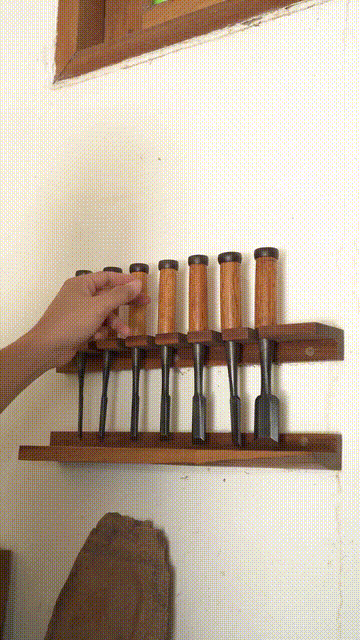
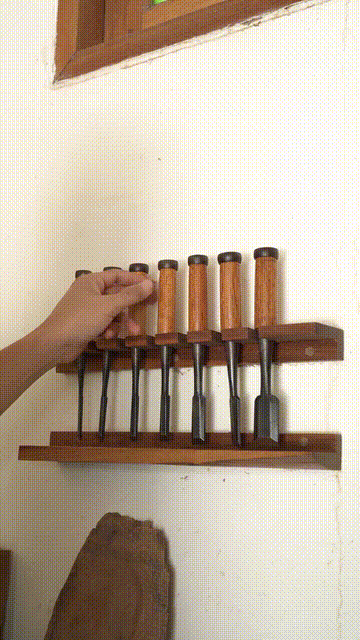
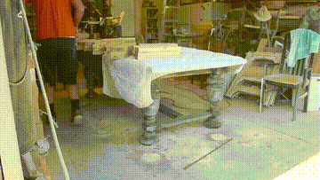
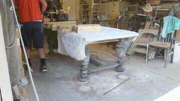
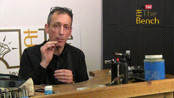
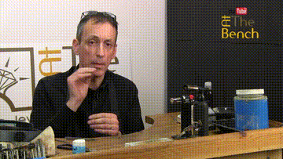

# HOI-Edit Visual Comparisons

To intuitively demonstrate the editing effect of SCPE, the table below presents three representative test cases: the left column shows videos generated by Wan2.2, and the right column shows videos enhanced using SCPE-learned rules—specifically, the abstract strategy of ‘using explicit spatial relative positions as anchors‘.

`wan2.2` videos:
- `5972911_resize1080p_scene-0_frame_0001_0_82b350f6.mp4`
- `bd_XHZlwC1E-0:01:07.934-0:01:15.141_frame_0001_4_ea4f4fe9.mp4`
- `DzR3K3E33BI-0:10:00.840-0:10:30.920_frame_0003_749_f5621081.mp4`

`+SCPE enhanced` videos:
- `5972911_resize1080p_scene-0_frame_0001_0.mp4`
- `bd_XHZlwC1E-0:01:07.934-0:01:15.141_frame_0001_4.mp4`
- `DzR3K3E33BI-0:10:00.840-0:10:30.920_frame_0003_749.mp4`

If playback does not work properly in your browser, please download the MP4 file and watch it locally.

| Original Instruction | wan2.2 | +SCPE enhanced |
| :--- | :---: | :---: |
| Make the person pull the rightmost chisel |  |  |
| Make the person walk to the right side of the table and stand |  |  |
| Make the person pick up the leftmost blowtorch on the table. |  |  |
